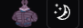

# Kyushu LB: Next.js & Dart Web Application

## Overview

This is a **full-stack web application** built with **Next.js (TypeScript) and Shadcn** for the frontend, and **Dart with Alfred and Sembast** for the backend. The project was originally developed for a client but is no longer actively maintained as it is no longer needed.

---

## Tech Stack

### Frontend:

- **Next.js (TypeScript)**
- **Shadcn/UI** (For UI components)
- **React-Auth-Kit** (Authentication handling)
- **Uploadthing** (For file uploads)

### Backend:

- **Dart**
- **Alfred** (Express.js-like API framework for Dart)
- **Sembast** (JSON-like local database)

---

## Features

### Frontend (Next.js + Shadcn)

- **Home Page** - A simple landing page.
- **Authentication System**
  - Sign In / Sign Up with **end-to-end encryption** (custom encryption implementation).
  - Token and Refresh Token Authentication.
  - **React-Auth-Kit** for handling token refreshing on the client side.
- **User Profiles**
  - View other user profiles with basic information.
  - Update profile images (Uses **Uploadthing** for file storage, updates on next login).
  - Change password (**end-to-end encrypted**).
- **Leaderboard**
  - View all players ranked by performance.
  - Users with roles above **Moderator** are hidden.
- **Account Dashboard**
  - Displays user rank, email, account type, account creation date, latest events, and latest matches.

### Backend (Dart + Alfred + Sembast)

- **Authentication & User Management**
  - Custom **token-based authentication** system.
  - CRUD operations for user accounts with different **access levels**.
- **Event Logging System**
  - Logs critical user and system events.
  - Events stored in a separate collection with reference IDs for traceability.
- **Scheduler System**
  - Tracks and executes tasks/functions at scheduled times.
  - Uses a **persistent map** to store scheduled tasks, ensuring execution even if the API restarts.
- **Challenge System**
  - Users can challenge others.
  - A random **Admin** and **Moderator** are assigned to each challenge.
  - Challenges are logged in the **event collection**.
- **Admin & Moderation Tools**
  - View logs (Admins and higher roles only).

---

## Screenshots

| Home Page | Sign In | Sign Up |
|-----------|---------|---------|
|  |  |  |
| Successful Sign In | User Dashboard | Leaderboard |
|  |  |  |
| User Profile | Logs | Profile Image (Before Update) |
|  |  |  |
| Edit profile page | Edit Profile Image Upload (Uploadthing) | Profile Updated |
|   |  |   |
| Profile Image (After next sign in) |
|   |


---

## Deployment & Usage

As this project is no longer actively maintained, deployment instructions are not provided. However, you may clone the repository and run the frontend/backend separately:

### Run Frontend

```sh
cd frontend
npm install
npm run dev
```

### Run Backend

```sh
cd backend
dart pub get
dart run
```

## Project Status

🚨 **This project is no longer maintained as it is not needed by the client anymore.** 🚨

Feel free to fork or modify the code for your own purposes!

## License

MIT License. See `LICENSE` for details.
